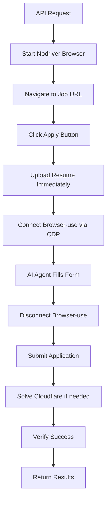

# Hybrid Nodriver + Browser-Use Auto-Apply System

A sophisticated job application automation system that combines the proven reliability of **nodriver** for specialized tasks with the intelligent form-filling capabilities of **browser-use** AI agents.

## 🏗️ Hybrid Architecture

This implementation uses a **best-of-both-worlds** approach:

### Phase 1: Nodriver - Browser Setup & Navigation
- **Real Browser**: Starts Brave browser with proper user profile
- **CDP Debug Mode**: Enables Chrome DevTools Protocol for browser-use connection
- **Navigation**: Goes to job URL and clicks "Apply" button
- **Proven Reliability**: Uses the same browser startup methodology as the original nodriver_apply.py

### Phase 1.5: Nodriver - Immediate Resume Upload
- **Resume Upload**: Uploads resume immediately after apply button using proven detection
- **Smart Detection**: Uses scoring algorithm to identify correct file input fields
- **File Processing**: Handles PDF/DOCX files with proper naming conventions
- **Early Upload**: Ensures resume is available before form fields are filled

### Phase 2: Browser-Use - AI Form Filling
- **CDP Connection**: Connects to existing browser session via Chrome DevTools Protocol
- **Intelligent Agent**: Uses Google's Gemini LLM to understand and fill forms
- **Natural Language**: Processes user profile data and maps to form fields
- **Adaptive**: Handles dynamic forms, dropdowns, checkboxes, and text areas
- **Resume Aware**: Skips file upload fields since resume is already uploaded

### Phase 3: Nodriver - Specialized Handling
- **Cloudflare Verification**: Handles Turnstile challenges with visual LLM analysis
- **Final Submission**: Submits the completed form and verifies success

## 🚀 Key Advantages

### Reliability
- **Proven Resume Detection**: Retains the original scoring-based file input detection
- **Real Browser Profile**: Uses actual user profiles with cookies and session data
- **Cloudflare Handling**: Maintains the visual coordinate-guessing approach that works

### Intelligence  
- **AI Form Understanding**: Browser-use agent intelligently interprets form requirements
- **Natural Language Input**: Users provide profile data in plain text format
- **Adaptive Filling**: Handles various form layouts and field types automatically

### Performance
- **Single Browser Session**: No multiple browser startups or profile switching
- **CDP Efficiency**: Browser-use connects instantly to existing session
- **Targeted AI Usage**: AI only used for complex form interpretation, not specialized tasks

## 📋 Features

- ✅ **Hybrid Architecture**: Nodriver + Browser-use via CDP
- ✅ **Real Browser Session**: Uses actual Brave browser with user profile
- ✅ **AI Form Filling**: Intelligent field mapping and completion
- ✅ **Resume Upload Detection**: Proven file input scoring algorithm
- ✅ **Cloudflare Verification**: Visual Turnstile solving with LLM
- ✅ **Progress Monitoring**: Real-time status updates via FastAPI
- ✅ **Environment Variables**: Secure API key management
- ✅ **Error Handling**: Comprehensive error recovery and reporting

## 🔧 Installation

1. **Install Dependencies**:
   ```bash
   pip install -r requirements_hybrid.txt
   ```

2. **Configure API Key**:
   Create a `.env` file with your Google API key:
   ```env
   GOOGLE_API_KEY=your-actual-gemini-api-key-here
   ```

3. **Install Brave Browser**:
   Make sure Brave browser is installed at the expected location for your OS.

## 🎯 Usage

### 1. Start the Server
```bash
python browseruse_apply.py
```
The server will start on `http://localhost:8001`

### 2. Submit Application Request
```python
import httpx
import asyncio

async def apply_to_job():
    async with httpx.AsyncClient() as client:
        response = await client.post(
            "http://localhost:8001/auto-apply",
            data={
                "url": "https://company.com/careers/job-id",
                "prompt": """
                John Doe
                Software Engineer with 5 years experience
                Email: john.doe@example.com
                Phone: (555) 123-4567
                LinkedIn: https://linkedin.com/in/johndoe
                
                Experience in Python, React, AWS, Docker
                Strong background in full-stack development
                """
            }
        )
        
        result = response.json()
        task_id = result["task_id"]
        print(f"Started task: {task_id}")

asyncio.run(apply_to_job())
```

### 3. Monitor Progress
```python
async def monitor_progress(task_id):
    async with httpx.AsyncClient() as client:
        while True:
            response = await client.get(f"http://localhost:8001/auto-apply-status/{task_id}")
            data = response.json()
            
            print(f"Status: {data['status']} - {data['message']}")
            
            if data["status"] in ["completed", "failed"]:
                break
                
            await asyncio.sleep(3)
```

## 🔄 Process Flow



## 📊 API Endpoints

### POST `/auto-apply`
Start a new job application process.

**Request Body:**
- `url` (string): Job application URL
- `prompt` (string): User profile information in natural language
- `resume` (file, optional): Resume file (PDF/DOCX)

**Response:**
```json
{
  "task_id": "uuid-here",
  "status": "starting",
  "message": "Application process started"
}
```

### GET `/auto-apply-status/{task_id}`
Get the current status of an application task.

**Response:**
```json
{
  "task_id": "uuid-here",
  "status": "processing",
  "message": "AI agent is filling out the form",
  "phase": "form_filling"
}
```

## 🎛️ Configuration

### Browser Configuration
The system automatically detects Brave browser installation:
- **Windows**: `C:/Program Files/BraveSoftware/Brave-Browser/Application/brave.exe`
- **macOS**: `/Applications/Brave Browser.app/Contents/MacOS/Brave Browser`
- **Linux**: `/usr/bin/brave-browser`

### Profile Management
- **User Data**: Stored in `config/browseruse/profiles/default`
- **Session Persistence**: Maintains cookies and login sessions
- **Extensions**: Supports browser extensions if installed

### CDP Configuration
- **Debug Port**: Uses port 9222 for Chrome DevTools Protocol
- **Connection**: Browser-use connects to `http://127.0.0.1:9222`
- **Session Sharing**: Both nodriver and browser-use use the same browser instance

## 🧪 Testing

Run the test suite:
```bash
python test_browseruse_apply.py
```

The test script includes:
- Server connectivity verification
- Status endpoint testing
- Complete application flow testing (with example data)

## 🔧 Troubleshooting

### Browser Issues
- **Profile Conflicts**: Ensure no other Chrome/Brave instances are using the same profile
- **CDP Port**: Check that port 9222 is available
- **Executable Path**: Verify Brave browser installation location

### API Issues
- **Environment Variables**: Ensure `GOOGLE_API_KEY` is set in `.env` file
- **Dependencies**: Install all requirements with `pip install -r requirements_hybrid.txt`
- **Port Conflicts**: Server runs on port 8001 (configurable)

### Form Filling Issues
- **Complex Forms**: The AI agent may need additional context for unusual form layouts
- **Dynamic Content**: Some forms load content dynamically - the system waits for elements
- **Field Recognition**: Browser-use uses advanced element detection and context understanding

## 🆚 Comparison with Original

| Feature | Original Nodriver | Hybrid Approach | Browser-use Only |
|---------|------------------|----------------|-----------------|
| **Form Intelligence** | Manual element discovery | AI-powered understanding | AI-powered understanding |
| **Resume Upload** | ✅ Proven scoring system | ✅ Same proven system | ❌ Basic file handling |
| **Cloudflare Handling** | ✅ Visual LLM solving | ✅ Same visual solving | ❌ No specialized handling |
| **Browser Profile** | ✅ Real user profile | ✅ Same real profile | ❌ Isolated profile |
| **Reliability** | ✅ Predictable | ✅ Best of both | ⚠️ LLM dependent |
| **Adaptability** | ❌ Brittle forms | ✅ Intelligent forms | ✅ Intelligent forms |
| **Performance** | ⚡ Fast execution | ⚡ Balanced | 🐌 LLM processing |
| **Maintenance** | 🔧 High (form changes) | 🔧 Low | 🔧 Low |

## 🔐 Security Considerations

- **API Keys**: Store securely in `.env` file, never commit to version control
- **Browser Profile**: Contains personal cookies and session data
- **File Uploads**: Validate resume files before processing
- **CDP Access**: Chrome DevTools Protocol provides full browser access

## 📈 Performance Metrics

Typical application completion times:
- **Simple Forms**: 30-60 seconds
- **Complex Forms**: 1-3 minutes  
- **With Resume Upload**: +15-30 seconds
- **With Cloudflare**: +10-20 seconds

## 🔄 Future Enhancements

- **Multiple Browser Support**: Chrome, Firefox, Edge compatibility
- **Enhanced AI Context**: Industry-specific form understanding
- **Batch Processing**: Multiple applications in sequence
- **Success Analytics**: Application outcome tracking
- **A/B Testing**: Different application strategies

---

This hybrid system represents the evolution of job application automation, combining proven reliability with cutting-edge AI capabilities. 